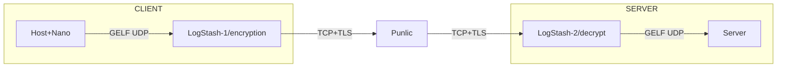
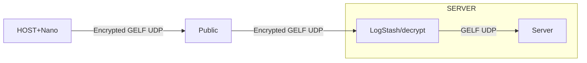
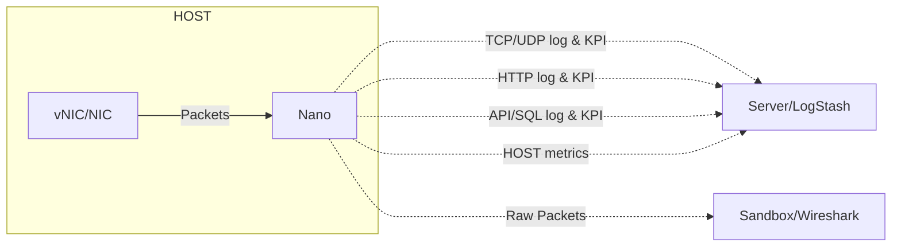
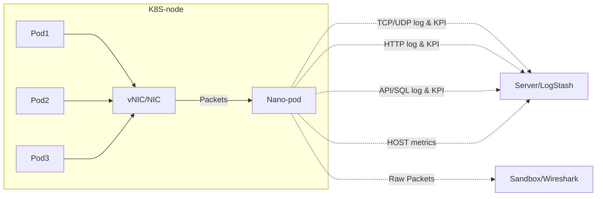

------

layout: default  

title: FAQ-Safety Related  

parent: faq  

nav_order: 2  

------

  

<h1 style="font-size: 30px;">MicroFlow Nano</h1>  
<h2 style="font-size: 50px;">FAQ-Safety Related</h2>

  

[TOC]

------

# 🚒Safety Related

## How to ensure that it does not affect business operations?

This question needs to be explained in three parts.

- Firstly, deployment and operation interference.  Please refer to "**Do I need to restart or change the host or business configuration?**" and "**Is Nano safe?**" 
- Secondly, resource occupation during runtime.  Please refer to "**Do I need to add new computing resources for Nano?**".
- Thirdly, how to ensure data security.  Please refer to "**Can the data output by Nano be encrypted?**" and "**Do I need to export the host traffic to the outside?**".

In summary, Nano will not have any clear impact on users' business systems during deployment or operation.

## Is Nano safe

As a probe program for processing fine-grained traffic log data, any concerns users may have about security are quite reasonable.  Naturally, the security of Nano has also been thoroughly considered and designed, as reflected in the following points:

- **Resource security:** The extremely low resource overhead and upper limit control algorithm are sufficient to ensure that Nano does not compete with other programs for computing resources, which is the most important design for Nano's resource security. Please refer to "Nano's Processing Performance Reference Metrics" for details;
- **Program security:** Nano is a standalone program, which significantly reduces security risks from the perspective of software supply chain and dependency environment. Additionally, we also provide an open-source version for medium to large-scale users, alleviating concerns about code risks;
- **Data Security:** Nano offers a data encryption feature using its proprietary algorithm, which users can opt to enable. In this scenario, the receiving end should utilize Logstash, as we have developed a Logstash plugin specifically for decryption purposes;

## Can the data output by Nano be encrypted?

**Method 1:** For scenarios requiring encryption, the simplest method is to use the encryption and decryption function of back-to-back LogStash; This method is commonly used for cross public network transmission.

**Method 2:** Nano provides a data encryption feature option using its own algorithm, which users can choose to enable;

For the receiving end, we recommend using Logstash, for which we have developed a Logstash plugin for decryption functionality.  Additionally, Logstash supports a wide range of Output methods and objects.

## Do I need to export the host traffic to the outside?	

NOT REQUIRED.

- Firstly, Nano has the capability to export raw packets to the external environment in real-time or offline;  however, doing so will significantly affect the performance of the environment, cloud network, and host. Therefore, we strongly advise users against doing this;
- In fact, Nano is specifically designed to extract and calculate fine-grained traffic logs required for monitoring and security scenarios within the program, with ultra-high performance and ultra-low consumption. Therefore, in most cases, users no longer need Raw Packets for packet parsing.
- Doing so not only has no significant impact on the environment, cloud network, and hosts, but also easily meets various cross-cloud and cross-domain cloud network monitoring and risk detection requirements.

## Can Nano parse HTTPS?

- High version Nano can parse SSL/TLS plaintext without a CA certificate; But only limited to Linux-64; Windows does not support;
- Low version Nano does not support parsing encrypted traffic; However, in most cases, this does not affect Nano from achieving its intended value! Because the actual deployment location of Nano in production environments is usually before loading HTTPS or after unloading HTTPS; In other words, in most cases, where Nano is deployed, HTTPS is not the primary traffic, so there is no need to worry about the encryption and decryption issues of HTTPS.

------

**www.microflow.io**

**microflow.io@gmail.com**

**07/23/2023**

