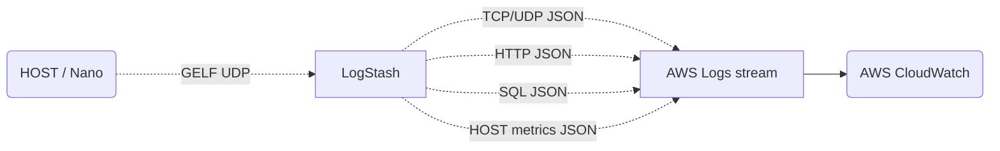
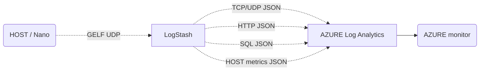
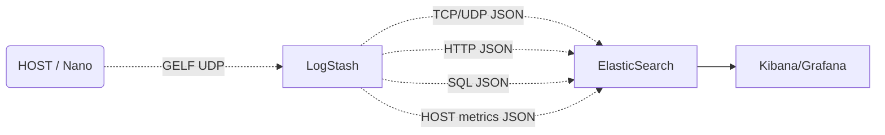
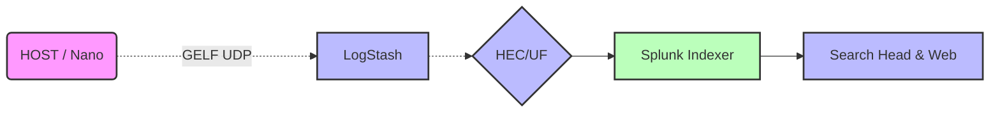
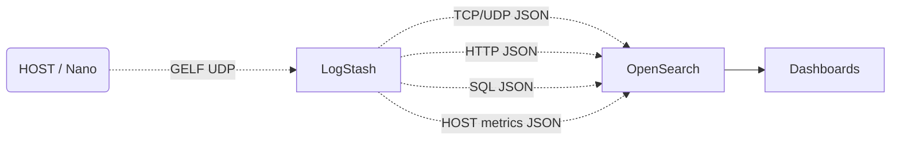
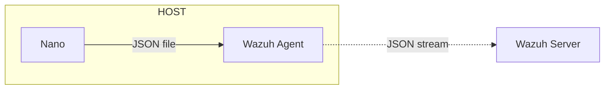
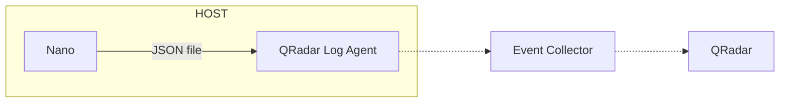

------

layout: default  

title: FAQ-Solution Integration  

parent: faq  

nav_order: 6  

------

  

<h1 style="font-size: 30px;">MicroFlow Nano</h1>  
<h2 style="font-size: 50px;">FAQ-Solution Integration</h2>

  

[TOC]

------

# 🎨Solution Integration

## Which third-party products can Nano be compatible with?

Nano outputs data in JSON over GELF UDP;  and by integrating with LogStash, it can adapt to almost all products that require fine-grained traffic log data.

- Log analysis platforms: ELK/EFK, Splunk, Graylog, OpenSearch;
- Public cloud log services: AWS Cloudwatch/Log, AZURE Monitor/Log Analytics;  
- Observability solutions: Datadog/Log Management, New Relic/Logs;
- Risk detection solutions: SOC-based platforms, Wazuh, QRadar, etc.

## Which risk detection engines can be adapted to Nano's data?

The "Nano+ risk detection engine" can effectively address the blind spots in cloud-based risk detection, especially for application-layer lateral movement attacks.

Users can deploy our open-source WAF engine, ModSecurity for Anylog (abbreviated as MSA), which is modified based on ModSecurity;

You can also use Wazuh (requiring the writing of an adaptation mapping) to directly leverage Nano's JSON data for detecting risks within the cloud.

## How to integrate with AWS CloudWatch?	

CloudWatch lacks high-quality traffic logs, and as a result, it lacks fine-grained traffic monitoring capabilities and application performance monitoring capabilities.  Nano can easily and quickly fill this gap;

"Nano + CloudWatch Logs" can achieve non-intrusive implementation for environments, hosts, and businesses, with cloud network performance management NPMD, Web/HTTP/API performance monitoring, SQL performance monitoring, and other application scenarios. The schematic diagram of the method is as follows:

## How to integrate with AZURE Monitor?

Minotor lacks high-quality traffic logs, and consequently, it lacks fine-grained traffic monitoring capabilities and application performance monitoring capabilities.  Nano can easily and quickly address this shortcoming;

"Nano + AZURE Logs Analystics" can achieve non-intrusive monitoring of environments, hosts, and businesses, as well as cloud network performance management (NPMD), Web/HTTP/API performance monitoring, SQL performance monitoring, and other application scenarios. The schematic diagram of the method is as follows:

## How to adapt ELF/EFK?

The ELK/EFK solution includes the Packetbeat tool, which has similar functions to Nano. However, we believe that users can make a product that better meets their own needs by comparing the processing capabilities, deployment convenience, resource consumption, all-weather operation capability, and functional completeness of the two probes.

## How to adapt to Splunk?	

Splunk's solution includes a switch-based traffic analysis product that mirrors traditional solutions, but it lacks a host-based packet capture and analysis product. Therefore, in cloud and cloud-native environments, there are significant limitations in its solution.

Based on this, we recommend the solution of Splunk + Nano to achieve "cloud network performance management (NPMD) in an ultra-lightweight manner,

Web/HTTP/API performance monitoring, SQL performance monitoring, east-west risk monitoring, threat intelligence comparison, suspected mining hosts, incident traceback analysis, and other application scenarios.

## How to adapt to Graylog?

The Graylog solution lacks the traffic analysis capabilities similar to ELK/EFK/Packetbeat, and therefore does not possess the functionality and scenarios required to achieve fine-grained traffic observability within cloud and cloud-native environments.  However, the combination of Graylog and Nano can perfectly address this shortcoming;

It can assist Graylog users in quickly implementing various application scenarios such as "cloud network performance management (NPMD), Web/HTTP/API performance monitoring, SQL performance monitoring, east-west risk monitoring, threat intelligence comparison, suspected mining hosts, incident traceback analysis, and more";

Especially, Nano has specifically designed relevant RESTful management functions for Graylog. For Graylog users, they only need to log in to Graylog-

On the Sidecar page, various management and configuration of Nano can be completed based on the Sidecar method.  Therefore, Graylog + Nano is very simple, as shown below:

## How to adapt to AWS OpenSearch?

The OpenSearch solution lacks fine-grained traffic log collection and analysis capabilities, and therefore does not possess the functionality and scenarios required to achieve fine-grained traffic observability within cloud and cloud-native environments.  However, the combination of OpenSearch and Nano can perfectly address this shortcoming;

It can assist OpenSearch users in swiftly implementing various application scenarios, including "cloud and network performance management (NPMD), Web/HTTP/API performance monitoring, SQL performance monitoring, east-west risk monitoring, threat intelligence comparison, suspected mining hosts, incident traceback analysis, and more";  the schematic diagram is as follows:

## How to adapt Wazuh?

The integration of Nano with Wazuh has established a closed-loop security capability that transforms "visibility" into "understanding" for fine-grained browsing metrics within the cloud.

Nano achieves fine-grained visibility by deeply collecting data such as network traffic, API calls, and identity authentication in the cloud environment, and comprehensively recording protocol content such as HTTP, SQL, and DNS.  Once the data is imported into Wazuh, with its rule engine and correlation analysis capabilities, it can detect threats in multiple dimensions, including web attacks, data breaches, injection attacks, and abnormal access, providing comprehensive technical support for cloud security operations.  The deployment method is as follows:

## How to adapt to IBM QRadar?

The integration of Nano with QRadar has established a closed-loop security capability that transforms the "visibility" of fine-grained browsing data within the cloud into "understanding" of it.

Nano provides fine-grained visibility by deeply collecting data such as network traffic, API calls, data queries, and identity authentication in the cloud environment, and comprehensively recording protocol content such as HTTP, SQL, and DNS.  After importing data into QRadar, with its rule engine and correlation analysis capabilities, it can significantly enhance QRadar's ability to detect risks within the cloud and analyze the context of various alerts. It is a beneficial supplement to the QRadar solution.  The deployment method is as follows:

------

**www.microflow.io**

**microflow.io@gmail.com**

**07/23/2023**

